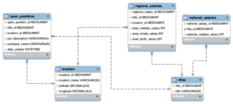

# data_mining_project
# Description:
The jobhunt_cli function scrapes data from the website "www.monster.com". 
"www.Monster.com" is a search engine for jobs located at the United States. 
The function retrieves up to 250 jobs (the maximum number of jobs that can appear on the site), 
scrapes the name of the company that posted the job, the job title, location and when was it applied. 
The function then stores all data in a mysql database ("mining") which contains the following 5 tables:

1. location table
2. regional_salaries
3. national_salaries
4. open_positions
5. titles

# Input parameters:
At this point, the function asks the user to enter username and password for database access
 and to provide two inputs: the job location and the job title.

# Installations required:
The jobhunt_cli function needs the following libraries (requirements.txt):

### Minimal Requirements:

- Python 3.6.10
- PyMySQL==0.9.3
- PySocks==1.7.1
- beautifulsoup4==4.9.3
- brotlipy==0.7.0
- geopy==2.0.0
- lxml==4.6.2
- mkl-fft==1.1.0
- mkl-random==1.1.1
- mkl-service==2.3.0
- mysql-connector-python==8.0.18
- pandas==1.1.1
- pip==20.2.2
- pyOpenSSL==19.1.0
- wheel==0.35.1
- run database_setup.py to set up the initial mining database.
- run mining_database_connection.py to setup all database tables.